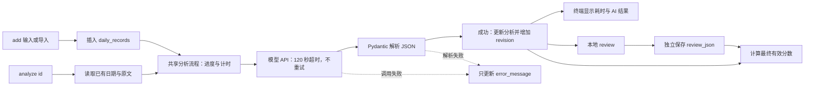

# 技术架构

## 第一版原则

Kiseki 当前是个人原型，不是准备发布的通用平台。架构目标是尽快得到一个自己能连续使用的产品，而不是提前解决扩展性、多人协作和生产级容错。

第一版遵循以下规则：

- 能用少量文件完成，就不增加分层和接口。
- 只接入一个实际使用的模型 API。
- 只使用一个 SQLite 数据库和一张核心表。
- 不建立 Provider 系统、迁移框架、重试队列或测试目录。
- 发现真实需求后再拆分，而不是根据想象提前设计。

## 数据流



`add` 始终先保存原文，再进入共享分析流程；`analyze <id>` 读取已有记录后进入同一流程，不插入新记录。请求前立即显示当前配置的模型并刷新终端，使用 `time.perf_counter()` 统计耗时。模型请求固定超时 120 秒且关闭 SDK 自动重试，不建设独立状态机、队列或后台任务。

成功时在同一次 SQLite 更新中写入模型、分析 JSON 和提示词版本，清除旧错误，并让 revision 原子加一；`review_json` 不被覆盖，因此旧 Review 会按既有规则派生为 stale。失败时只更新 `error_message`：已有分析、模型、提示词版本、revision 和 Review 均保留，失败本身不会让有效 Review 变为 stale。

`review` 是独立的本地分支，不经过模型 API。它不修改 `raw_text` 或 `analysis_json`，只保存人工判断，并在读取时与当前 AI 分析合成最终有效分数。

## 当前目录

```text
kiseki/
├── app.py          # argparse、终端输入和输出
├── database.py     # SQLite 建表和读写
├── model.py        # 直接调用选定的模型 API
├── review.py       # Review 状态和有效分数纯业务函数
├── schema.py       # AI 与 Review 的 Pydantic 结构
├── pyproject.toml
├── .env.example
├── data/
└── docs/
```

这是为校准闭环做的一次小范围职责拆分，仍然只使用普通函数，不增加 Repository、Service 容器或依赖注入框架。

## CLI

当前 CLI 提供五类操作：

```text
python app.py add
python app.py add --file <path> [--date YYYY-MM-DD]
python app.py list
python app.py show <id>
python app.py analyze <id>
python app.py review <id>
```

- `add`：交互输入日期和单行感想，调用模型并保存结果。
- `add --file`：读取 UTF-8 的 `.md`/`.txt` 完整内容；文件路径不写入数据库。
- `list`：查看最近记录的日期、AI 总分、最终有效总分、Review 状态和摘要。
- `show`：查看某条记录的原文、完整 AI 分析、人工 Review 和有效分数。
- `analyze`：原地分析未分析或失败记录；已有成功分析时默认取消，明确确认后才覆盖当前成功分析。
- `review`：在本地接受、修正或否决已有 AI 分析，不调用模型。

## 数据库

第一版使用 `data/kiseki.db`，启动时执行 `CREATE TABLE IF NOT EXISTS`。

### daily_records

| 字段 | 用途 |
| --- | --- |
| id | 本地自增 ID |
| entry_date | 记录所描述的日期 |
| raw_text | 当天输入的原文 |
| model | 使用的模型名称 |
| analysis_json | 模型返回并解析后的完整 JSON；尚无结果时为空 |
| error_message | 最近一次分析错误；下一次成功时清空，已有成功分析不因错误而删除 |
| prompt_version | 当前分析使用的提示词版本；旧分析可为空 |
| analysis_revision | 当前分析 revision；新分析成功写入时原子加一 |
| review_json | 独立的人工 Review JSON；尚未 Review 时为空 |
| created_at | 创建时间 |

启动时先执行 `CREATE TABLE IF NOT EXISTS`，再用 `PRAGMA table_info` 检查缺失字段并逐列 `ALTER TABLE`。旧记录保留原值，旧分析允许 revision 为 0；这里没有引入迁移框架。

当前数据量很小，列表和详情可以直接读取并解析 `analysis_json` 与 `review_json`。暂时不拆分证据表、维度表、Review 表和分析历史表。

## Review 与有效分数

Review JSON 的持久化状态只有三种：

- `accepted`：认可 AI 分析，不保存分数覆盖。
- `adjusted`：至少保存一个字段覆盖；数字是人工值，`null` 是人工判断为未知。
- `rejected`：整次分析不可用于趋势，不保存分数覆盖。

`unreviewed` 和 `stale` 不写入 Review JSON：前者由 `review_json` 为空派生；后者由 Review 保存的 `analysis_revision`、模型或提示词版本与当前分析不一致派生。新的分析成功写入时增加 revision，但不删除旧 Review，因此旧 Review 可被显示为 stale。

最终有效分数始终在读取时由 `review.py` 的纯函数计算：

- `unreviewed` 和 `accepted` 使用当前 AI 分数。
- `adjusted` 优先使用人工覆盖，其余字段沿用 AI。
- `rejected` 没有有效分数。
- `stale` 忽略旧人工覆盖，暂时使用当前 AI 分数并明确标记。

这些函数不依赖 SQLite、`input()`、`print()` 或模型调用。未来采用 Textual、PySide6、FastAPI 或 Tauri 时，可以复用相同的 Review JSON、状态判断和有效分数计算，不必复用 CLI 交互代码。

## 模型输出

模型按照现有分析模板返回：

- 整体体验分。
- 六个基础维度。
- 摘要。
- 评分依据。
- 置信度。

Pydantic 的作用只是及时发现返回格式不符合预期，不在第一版建设复杂的校验恢复流程。解析失败时显示错误并保留日记原文；用户可用 `analyze <id>` 原地重试。每条记录仍只保存最新一次成功分析，没有分析历史。

## 配置与隐私

- 从 `.env` 读取 `KISEKI_API_KEY`、`KISEKI_BASE_URL` 和 `KISEKI_MODEL`，直接连接一个 OpenAI-compatible API；当前个人配置使用千问兼容接口。
- `.env` 与 `data/kiseki.db` 不提交到 Git。
- API Key 不写入数据库。
- `add` 和 `analyze` 会把记录日期与日记原文发送给对应模型服务商。
- `review`、`list` 和 `show` 只访问本地数据，不调用模型。

## 什么时候再扩展

只有在真实使用中出现明确需求时才增加：

- 需要保留多次分析结果时，再拆出分析历史表。
- 需要切换多个服务商时，再抽象 Model Provider。
- 数据结构频繁变化时，再引入迁移工具。
- CLI 确实影响持续记录时，再构建本地界面。
- 积累足够 Review 后，再讨论校准汇总、评分评估集或自动化测试。
